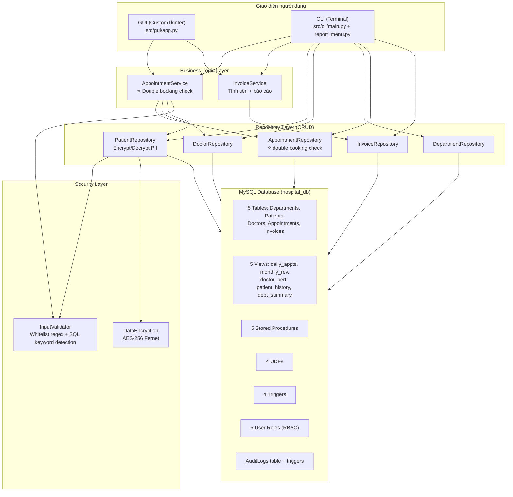
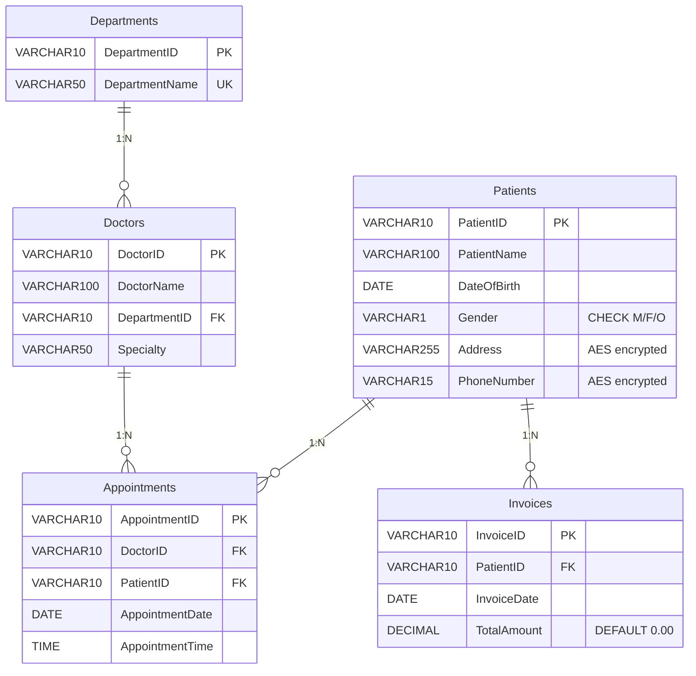

# 🏥 Hospital Management System — Tổng Quan Dự Án

> **Khóa học:** Database Management System - NEU DATCOM Lab
> **Đề bài:** Project 02 - Hospital Management
> **Stack:** MySQL 8.0 + Python 3.x (mysql-connector-python, customtkinter, cryptography)

---

## 1. Kiến Trúc Tổng Quan

---

## 2. Cấu Trúc File

| Thư mục | Mô tả | File chính |
|---------|--------|-----------|
| `database/scripts/` | 11 SQL scripts (chạy tuần tự 01→11) | DDL, DML, Indexes, Views, Procedures, Functions, Triggers, Security, Encryption, Audit |
| `database/diagrams/` | EER Diagram | `EER Diagram.png` |
| `src/models/` | 5 dataclass models | Patient, Doctor, Department, Appointment, Invoice |
| `src/repositories/` | 5 Repository classes (CRUD) | Parameterized queries, encryption tại PatientRepo |
| `src/services/` | 2 Service classes (business logic) | AppointmentService (double booking), InvoiceService |
| `src/security/` | Input validation + Encryption | InputValidator (whitelist), DataEncryption (Fernet AES) |
| `src/cli/` | CLI menu system | main.py (491 dòng), report_menu.py (227 dòng) |
| `src/gui/` | Desktop GUI (CustomTkinter) | app.py — RBAC login, Dashboard, Appointment form |
| `tests/` | 6 test files | SQL injection (12 tests), double booking, triggers, procedures, CRUD, encryption |
| `docs/` | 5 tài liệu | Business Rules, Demo Script, Normalization 3NF, Report Outline, Security Guide |

---

## 3. Database Schema (5 Bảng, chuẩn 3NF)

> **⭐ Key Constraint:** `UNIQUE INDEX idx_doctor_datetime (DoctorID, AppointmentDate, AppointmentTime)` — Chống double booking ở tầng DB.

---

## 4. Tính Năng Nổi Bật

### ⭐ Chống Double Booking (3 lớp)
1. **Python validation** — `AppointmentService.schedule_appointment()` kiểm tra trước khi insert
2. **Stored Procedure** — `sp_schedule_appointment` kiểm tra lại ở MySQL
3. **UNIQUE INDEX** — `idx_doctor_datetime` là tuyến phòng thủ cuối cùng ở DB

### ⭐ Auto Invoice (Trigger)
- `trg_after_appointment_insert` — Tự tạo/cập nhật hóa đơn (50,000 VND/lượt) khi có appointment mới
- `trg_after_appointment_delete` — Tự điều chỉnh/xóa hóa đơn khi hủy appointment

### 🔒 Bảo Mật (Defense in Depth — 5 lớp)
| Lớp | Cơ chế | File |
|-----|--------|------|
| 1 | **Input Validation** (whitelist regex + SQL keyword detection) | `input_validator.py` |
| 2 | **Data Encryption** (AES-256 Fernet cho Phone, Address) | `encryption.py` |
| 3 | **Parameterized Queries** (`%s` placeholders) | `repositories/*.py` |
| 4 | **Least Privilege** (5 DB roles, không DROP/ALTER) | `09_Security_Users.sql` |
| 5 | **Error Sanitization** (ẩn chi tiết SQL khỏi user) | `sanitize_error_message()` |

### 🔑 RBAC (5 roles)
| Role | Quyền |
|------|-------|
| `admin_hospital` | ALL PRIVILEGES |
| `doctor_user` | Đọc BN, quản lý lịch hẹn |
| `receptionist` | CRUD BN + lịch hẹn |
| `accountant` | Quản lý hóa đơn + báo cáo |
| `readonly_user` | Chỉ đọc (kiểm toán) |

### 📊 Advanced DB Objects
- **5 Views:** daily appointments, monthly revenue, doctor performance, patient history, department summary
- **5 Stored Procedures:** schedule, invoice, cancel, patient history, daily report
- **4 UDFs:** invoice total, patient age, doctor workload, patient spending
- **4 Triggers:** auto invoice (create/delete), validate appointment, block negative invoice

### 🖥️ GUI (CustomTkinter)
- Dark mode, RBAC login screen (dropdown auto-fill credentials)
- Dashboard với stat cards + security status panel
- Form đặt lịch khám với double booking + SQL injection protection
- Ẩn/hiện tính năng theo role (accountant/readonly không thấy nút đặt lịch)

---

## 5. Sample Data

- **6 Departments** (Cardiology, Neurology, Orthopedics, Pediatrics, Dermatology, General Medicine)
- **8 Patients** (tên tiếng Việt)
- **6 Doctors**
- **8 Appointments** (phân bổ qua 3 ngày 04/10-04/12/2025)
- **6 Invoices** (tổng ~11,250,000 VND)

---

## 6. Trạng Thái Dự Án

| Thành phần | Trạng thái |
|-----------|-----------|
| Database schema + data | ✅ Hoàn chỉnh |
| Advanced objects (Views, SP, UDF, Triggers) | ✅ Hoàn chỉnh |
| Security (RBAC, encryption, SQL injection prevention) | ✅ Hoàn chỉnh |
| Audit Logging | ✅ Hoàn chỉnh |
| Python models + repositories | ✅ Hoàn chỉnh (vẫn giữ TODO comments dạng "learning hints") |
| Services (business logic) | ✅ Hoàn chỉnh |
| CLI interface | ✅ Hoàn chỉnh |
| GUI interface | ✅ Hoàn chỉnh (Dashboard + Appointment form) |
| Tests | ✅ 6 test files (SQL injection, double booking, triggers, procedures, CRUD, encryption) |
| Documentation | ✅ 5 docs + README + SQL_injection.md (32KB) |
